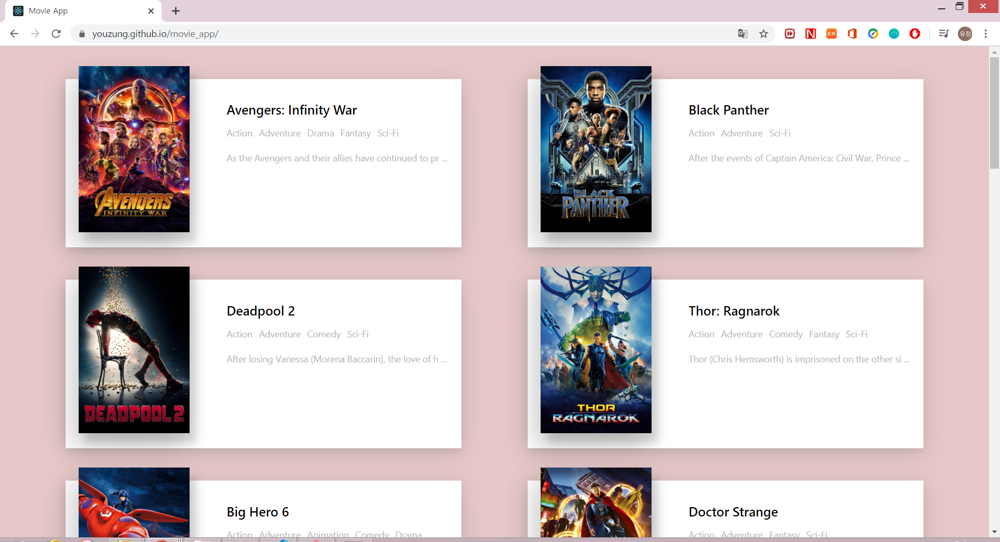
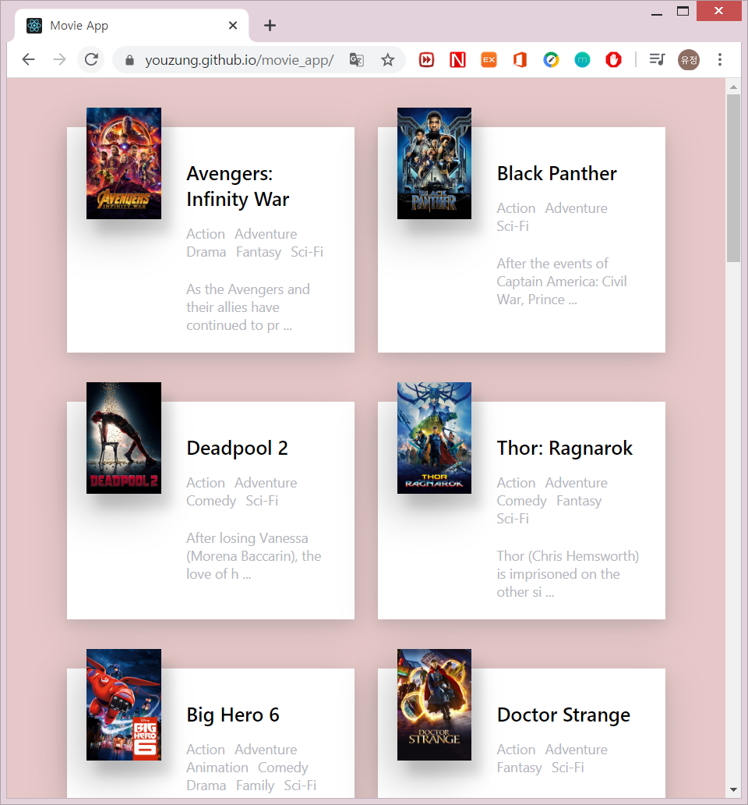
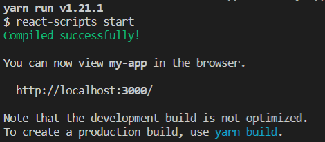
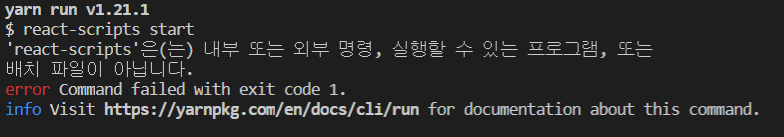

## Making a Movie app by using React






#### create-react-app으로 새로운 리액트 앱 만들기

```cmd
npm install -g create-react-app
create-react-app my-app

cd my-app
npm start( or yarn start)
```




#### yarn start 오류시



```cmd
yarn upgrade
yarn start
```


#### yarn build로 배포하기

1. yarn build

   - packge.json에 "homepage": "http://유저명.github.io/저장소명" 추가한 후 yarn build

2. yarn add --dev gh-pages

   - scripts에 predeploy, deploy 설정 후 yarn build

3. yarn run deploy

   - 저장소 연결 후 수행해야 함

     ``` bash
     git remote add origin https://github.com/유저명/저장소명.git
     git push-u origin master
     ```
